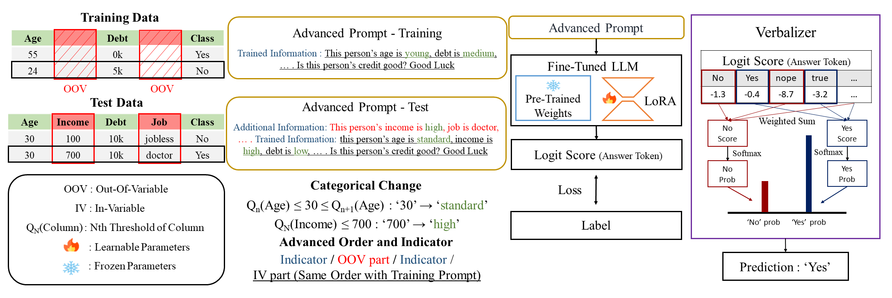

# LBC
# Language-Based-Classifier for OOV Generalization

## Abstract

Large Language Models (LLMs) have great success in natural language processing tasks such as response generation. However, their use in tabular data has been limited due to their inferior performance compared to traditional machine learning models (TMLs) such as XGBoost. We find that the pre-trained knowledge of LLMs enables them to interpret new variables that appear in a test without additional training, a capability central to the concept of Out-of-Variable (OOV). From the findings, we propose a Language-Based-Classifier (LBC), a classifier that maximizes the benefits of LLMs to outperform TMLs on OOV tasks. LBC employs three key methodological strategies: 1) Categorical changes to adjust data to better fit the model's understanding, 2) Advanced order and indicator to enhance data representation to the model, and 3) Using verbalizer to map logit scores to classes during inference to generate model predictions. These strategies, combined with the pre-trained knowledge of LBC, emphasize the model's ability to effectively handle OOV tasks. We empirically and theoretically validate the superiority of LBC. LBC is the first study to apply an LLM-based model to OOV tasks. 

*Figure 1: Overview of the Language-Based Classifier (LBC) methodology.*

This project includes code that is licensed under the MIT License by the following copyright holders:
Copyright (c) 2022 UWLeeLab Tuan Dinh Yuchen Zeng
